# Week 1 - Introduction to Machine Learning

Welcome to the Machine Learning Specialization! You're joining millions of others who have taken either this or the original course, which led to the founding of Coursera, and has helped millions of other learners, like you, take a look at the exciting world of machine learning!

# Overview of Machine Learning

## Welcome to machine learning!

## Applications of machine learning

# Supervised vs. Unsupervised Machine Learning

## What is machine learning?

Here's a definition of what is machine learning that is attributed to Arthur Samuel. 

He defined machine learning as the field of study that gives computers the ability to learn without being explicitly programmed.

>  

Samuel wrote a checkers playing program in the 1950s
The amazing thing about this program was that Arthur Samuel himself wasn't a very good checkers player. 
His program learned to get better and better at playing checkers because the computer had the patience to play tens of thousands of games against itself

## Supervised learning part 1

Supervised machine learning or more commonly, supervised learning, refers to algorithms that learn x to y or input to output mappings. 

The key characteristic of supervised learning is that you give your learning algorithm examples to learn from. 
For a given input x, you give the right answers (the correct label y )
It's by seeing correct pairs of input x and desired output label y that the learning algorithm learns to give a reasonably accurate prediction of the output.

 > 
 
So supervised learning algorithms learn to predict input, output or X to Y mapping

This housing price prediction example is the particular type of supervised learning called regression. 

> Regression is a statistical method used in finance, investing, and other disciplines that attempts to determine the strength and character of the relationship between one dependent variable (usually denoted by Y) and a series of other variables (known as independent variables).

 > 

## Supervised learning part 2

Supervised learning algorithms learn to predict input, output or X to Y mapping. 
Regression algorithms, which is a type of supervised learning algorithm learns to predict numbers out of infinitely many possible numbers. 
There's a second major type of supervised learning algorithm called a classification algorithm.

 > 

 One reason that this is different from regression is that we're trying to predict only a small number of possible outputs or categories. In this case two possible outputs 0 or 1, benign or malignant.

 > 

 Here's an example, instead of just knowing the tumor size, say you also have each patient's age in years. 

 > 

The two major types of supervised learning our regression and classification. In a regression application like predicting prices of houses, the learning algorithm has to predict numbers from infinitely many possible output numbers. Whereas in classification the learning algorithm has to make a prediction of a category, all of a small set of possible outputs.

 > 

## Unsupervised learning part 1

Don't let the name uncivilized for you, unsupervised learning is I think just as super as supervised learning

 > 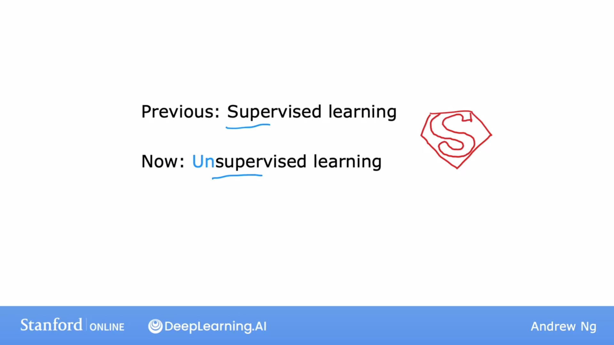
 
 
 An unsupervised learning algorithm, might decide that the data can be assigned to two different groups or two different clusters. And so it might decide, that there's one cluster what group over here, and there's another cluster or group over here. This is a particular type of unsupervised learning, called a clustering algorithm.
 
 > 

For example, clustering is used in google news, what google news does is every day it goes. And looks at hundreds of thousands of news articles on the internet, and groups related stories together.

 > 

 This image shows a picture of DNA micro array data, these look like tiny grids of a spreadsheet. And each tiny column represents the genetic or DNA activity of one person

 > 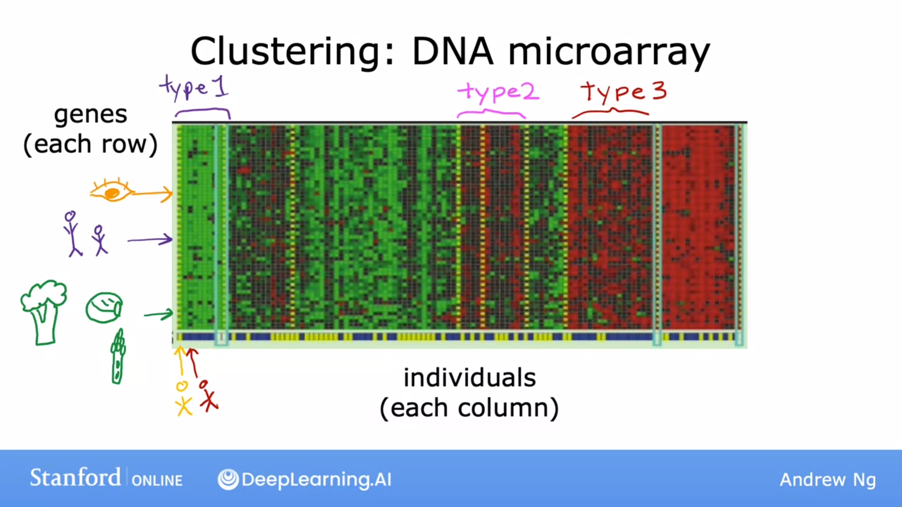

 Many companies have huge databases of customer information given this data. Unsupervised learning can you automatically group your customers, into different market segments so that you can more efficiently serve your customers. 

 > 

## Unsupervised learning part 2

Nn supervised learning, the data comes with both inputs x and input labels y, in unsupervised learning, the data comes only with inputs x but not output labels y, and the algorithm has to find some structure or some pattern or something interesting in the data.

 > 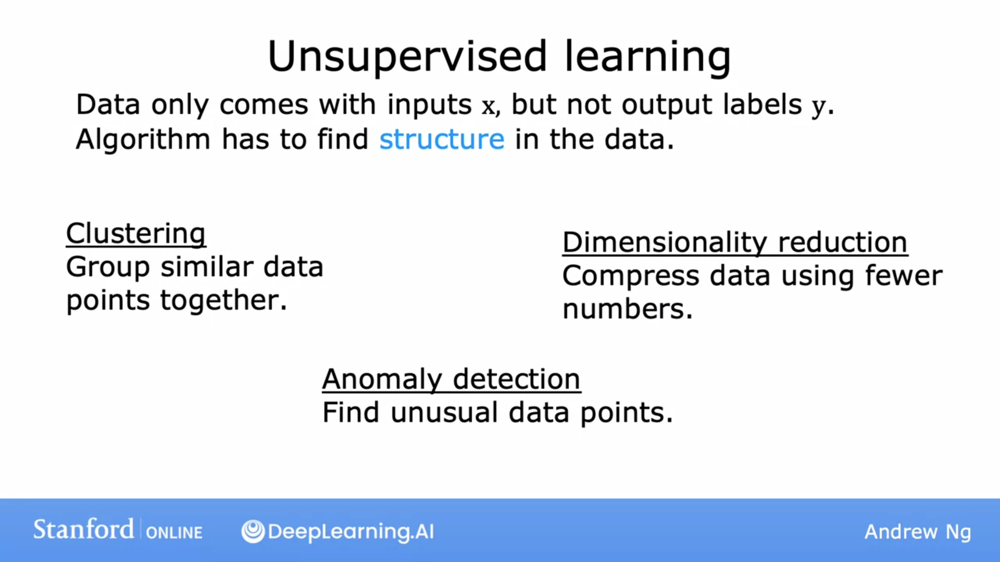

  - Clustering algorithm, which groups similar data points together
  - Anomaly detection, which is used to detect unusual events
  - dimensionality reduction. This lets you take a big data-set and almost magically compress it to a much smaller data-set while losing as little information as possible.

 > 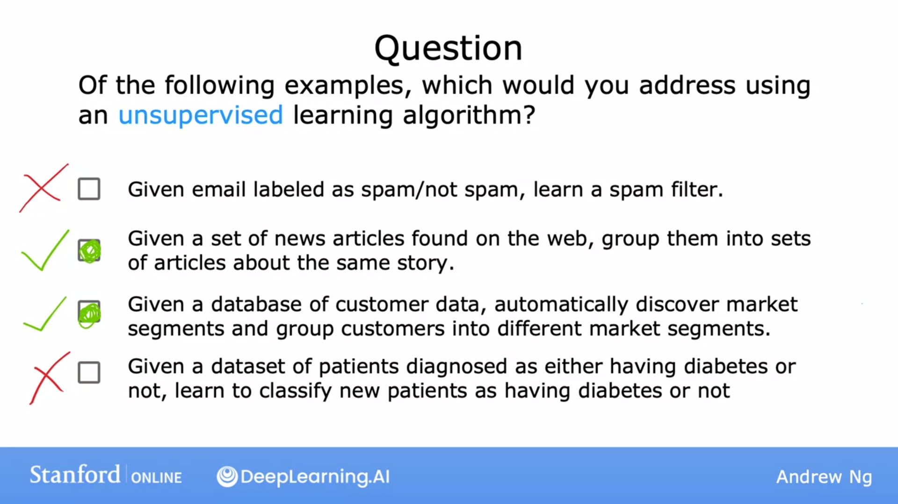

## Jupyter Notebooks

## Python and Jupyter Notebooks

# Practice Quiz: Supervised vs unsupervised learning

# Regression Model

## Linear regression model part 1

 <!-- img src="./images/w01-09-Linear_regression_model_part_1/img_2023-01-28_10-26-26.png" -->

 <!-- img src="./images/w01-09-Linear_regression_model_part_1/img_2023-01-28_10-26-46.png" -->

 
 The first model of this course, Linear Regression Model, just means fitting a straight line to your data. 
 
 It's probably the most widely used learning algorithm in the world today.

 > 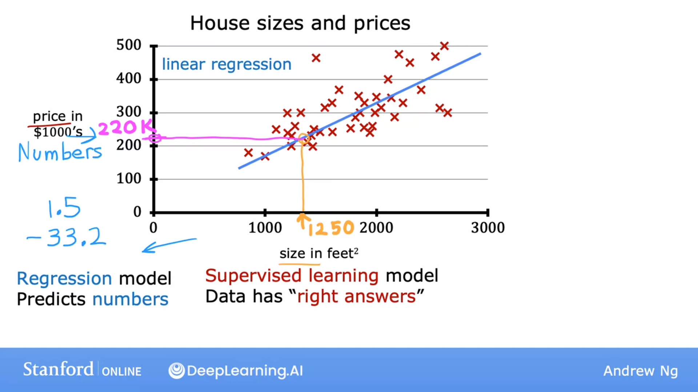

 <!-- img src="./images/w01-09-Linear_regression_model_part_1/img_2023-01-28_10-27-39.png" -->
 
In addition to visualizing this data as a plot here on the left, there's one other way of looking at the data that would be useful, and that's a data table here on the right. 

The data comprises a set of inputs. 

This would be the size of the house, which is this column here. 

It also has outputs. You're trying to predict the price, which is this column here. 

Notice that the horizontal and vertical axes correspond to these two columns, the size and the price. If you have, say, 47 rows in this data table, then there are 47 of these little crosses on the plot of the left, each cross corresponding to one row of the table. 

 > 

Terminology:
 - the dataset that you just saw and that is used to train the model is called a **training set**.  
 - the standard notation to denote the input here is lowercase x, and we call this the **input variable**, is also called a **feature** or an **input feature**. 
 - the standard notation to denote the output variable which you're trying to predict, which is also sometimes called the **target variable**, is lowercase y.

 > 

## Linear regression model part 2

 1. **Training set** in supervised learning includes both the **input features**, and **output targets** are the right answers to the model we'll learn from. 
 1. To train the model, you feed the training set, both the input features and the output targets to your **learning algorithm**.
 1. Then your supervised learning algorithm will produce some **function** called the **model** (historically, this function used to be called a **hypothesis**)
 1. The function f take a new **input feature** x and output and **estimate** or a **prediction** **y-hat** (in contrast, y is the target)

 > 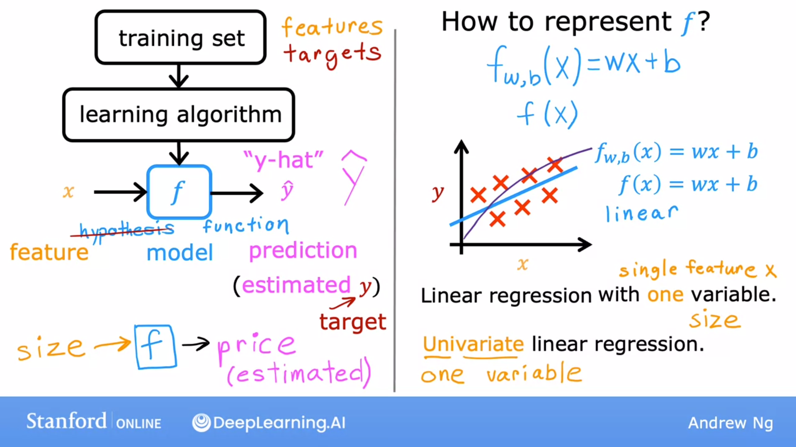

## Optional lab: Model representation

## Cost function formula

w and b are called the **parameters** of the model (or **coefficients** or **weights**). In machine learning parameters of the model are the variables you can adjust during training in order to improve the model

 > 

Depending on the values you've chosen for w and b you get a different function f of x, which generates a different line on the graph.

 > 

The **cost function** takes the prediction y hat and compares it to the target y by taking y hat minus y. This difference is called the error.

This is also called the **squared error cost function**, and it's called this because you're taking the square of these error terms. In machine learning different people will use different cost functions for different applications, but the squared error cost function is by far the most commonly used 

 > 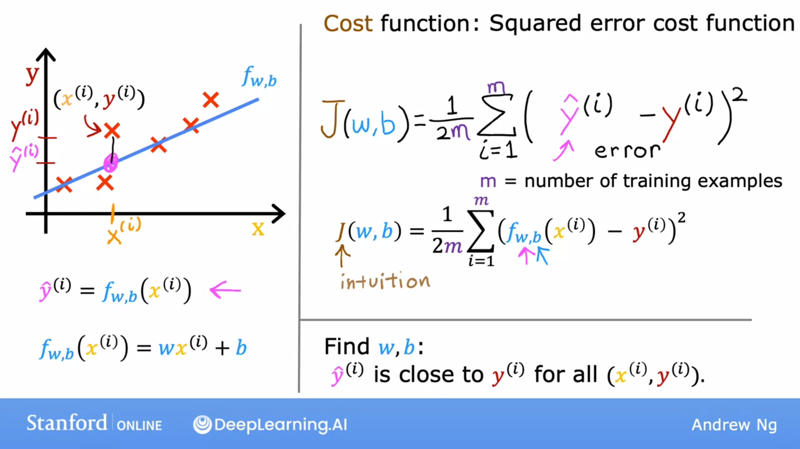

## Cost function intuition

In order for us to better visualize the cost function J, we work with a simplified version of the linear regression model (b=0). 

 > 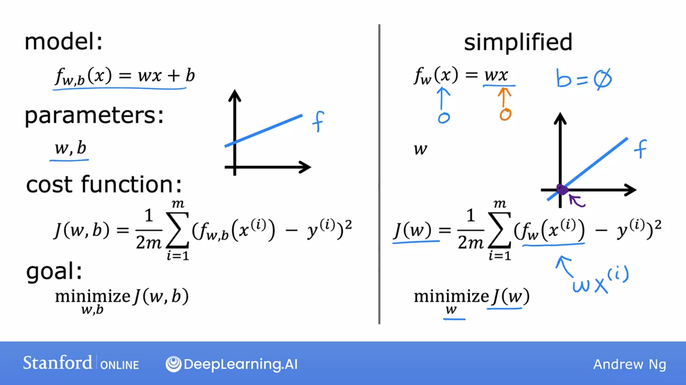

Now, using this simplified model, let's see how the cost function changes as you choose different values for the parameter w. 
In particular, let's look at graphs of the model f of x, and the cost function J.

For w=1, J(1)=0
 > 
 
For w=0.5, J(0.5)=0.58...
 
 > 

 And so on...

 > 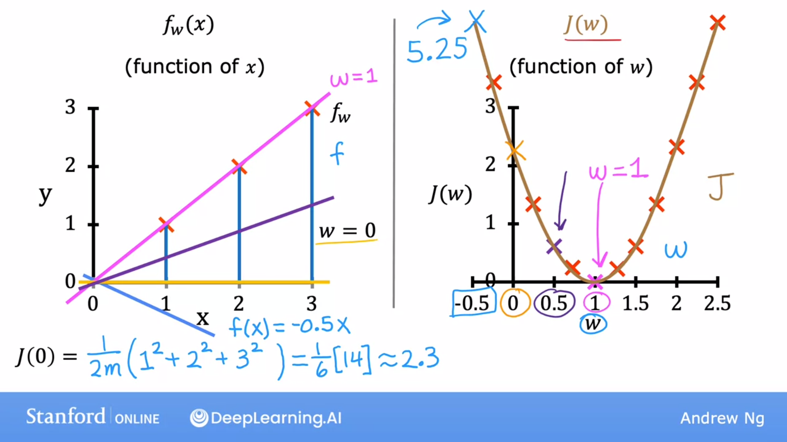
 
 In the more general case where we had parameters w and b rather than just w, you find the values of w and b that minimize J.
 
 > 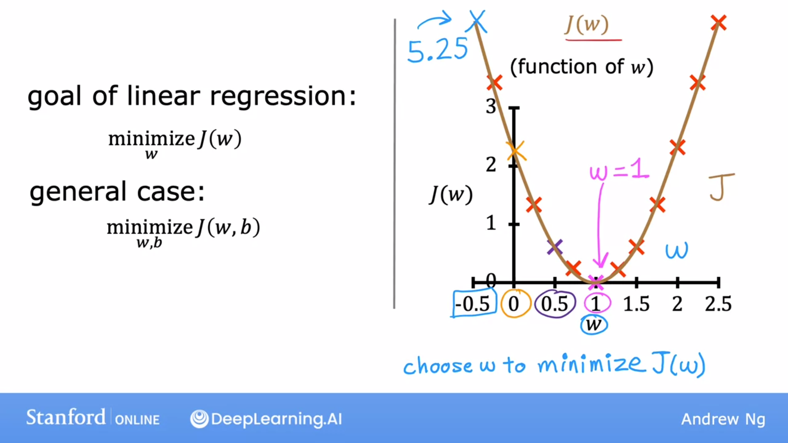

## Visualizing the cost function

In the last video, we had temporarily set b to zero in order to simplify the visualizations. Now, let's go back to the original model with both parameters w and b without setting b to be equal to 0.

 > 

**When we had only one parameter w**, the cost function had this U-shaped curve, shaped a bit like a soup bowl

 > 

**When we have two parameters**, w and b. The plots becomes a little more complex. It turns out that the cost function also has a similar shape like a soup bowl, except in three dimensions instead of two.

This looks like a soup bowl, or maybe a hammock

Any single point on this surface represents some particular choice of w and b. For example, if w was minus 10 and b was minus 15, then the height of the surface above this point is the value of j when w is minus 10 and b is minus 15. 

 > 
 
Visualisation of cost function using these 3D-surface plots

 > 

Visulisation of cost function using something called a contour plot
If you've ever seen a topographical map showing how high different mountains are, the contours in a topographical map are basically horizontal slices of the landscape of say, a mountain. This image is of Mount Fuji in Japan

 > 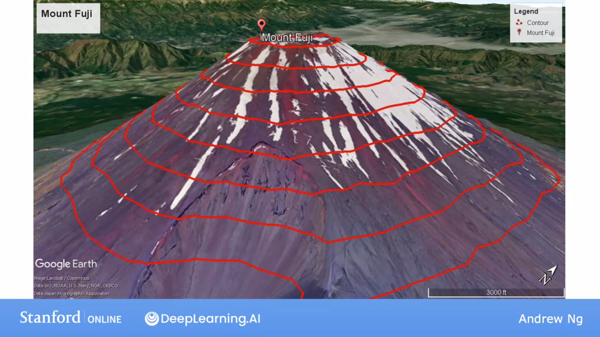

If you fly directly above the mountain, that's what this contour map looks like. 
It shows all the points, they're at the same height for different heights.

 > 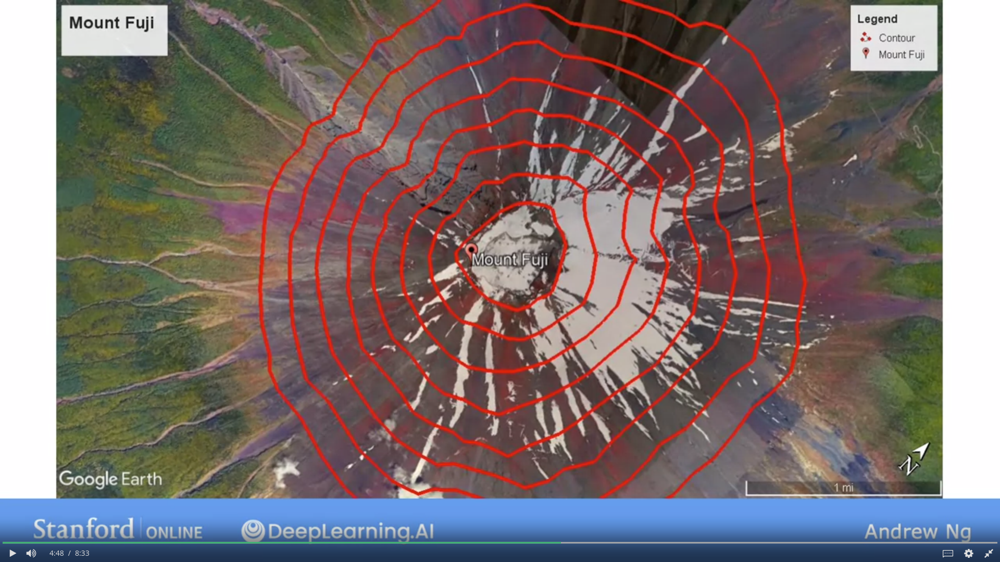

Next, here on the upper right is a contour plot of this exact same cost function as that shown at the bottom. The two axes on this contour plots are b, on the vertical axis, and w on the horizontal axis. What each of these ovals, also called ellipses, shows points have the same value for the cost function J.

In other words, the set of points which have the same value for the cost function J. To get the contour plots, you take the 3D surface at the bottom and you use a knife to slice it horizontally. 

Function J is at a minimum at the center of this concentric ovals

 > 

## Visualization examples

w=-0.15 and b=800

 > 

w=-0.13 and b=71

 > 

## Optional lab: Cost function

# Practice Quiz: Regression Model

# Train the model with gradient descent

## Gradient descent

 Gradient descent is an algorithm to find in systematic way the values of w and b that minimize the cost function.
 Gradient descent is used all over the place in machine learning, not just for linear regression, but for training for example some of the most advanced neural network models, also called deep learning models.

 > 

Now, let's imagine that this surface plot is actually a view of a slightly hilly outdoor park where the high points are hills and the low points are valleys.

You are physically standing at this point on the hill. Your goal is to start up here and get to the bottom of one of these valleys as efficiently as possible

What the gradient descent algorithm does is : 
1. you're going to spin around 360 degrees and look around and ask yourself
1. take a tiny little baby step in direction of steepest descent
1. after taking this first step, you're now at this point on the hill over here. Now let's repeat the process.

 > 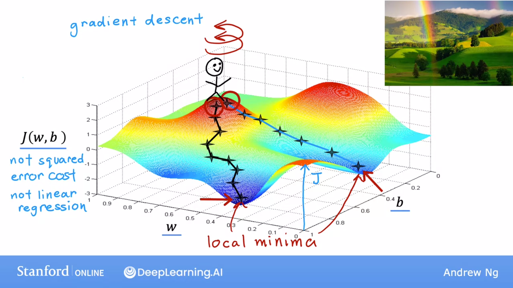

If you were to run gradient descent this second time, starting just a couple steps in the right of where we did it the first time, then you end up in a totally different valley. 

The bottoms of both the first and the second valleys are called **local minima**

## Implementing gradient descent

 > 

## Gradient descent intuition

 > 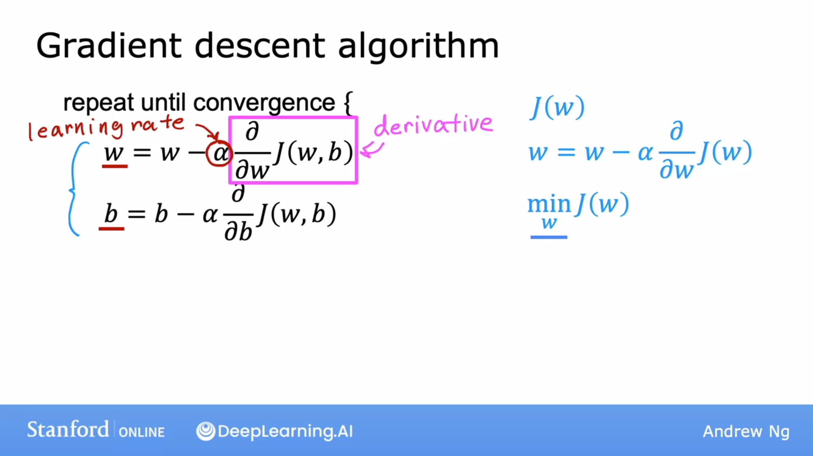
 > 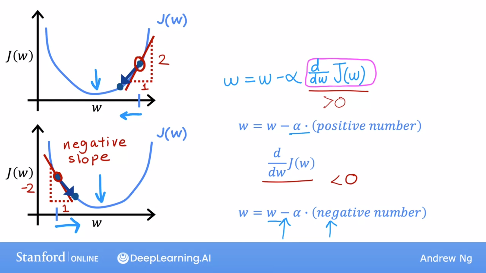

## Learning rate

 > 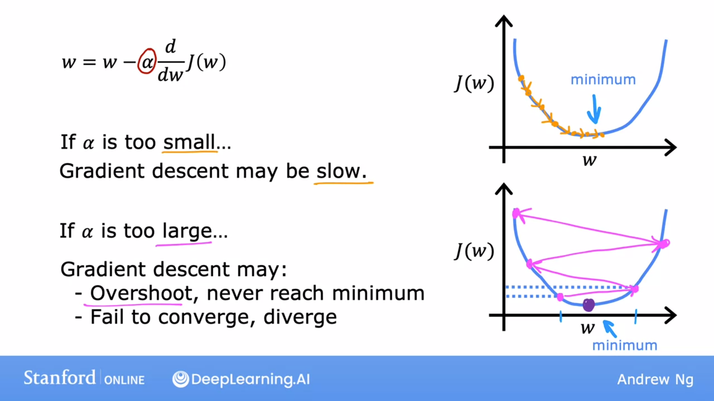
 > 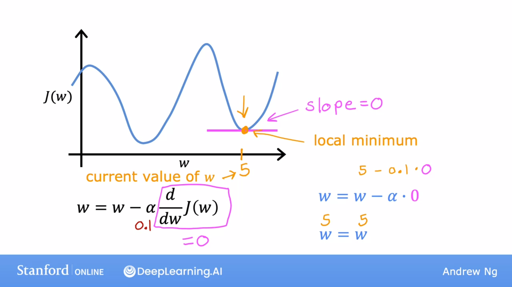
 > 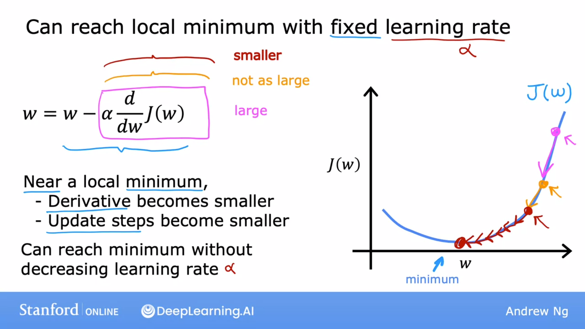

## Gradient descent for linear regression

 > 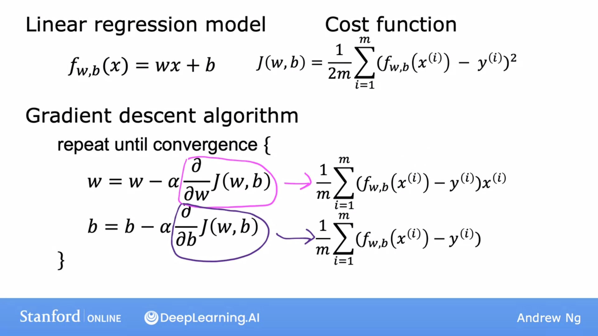
 > 
 > 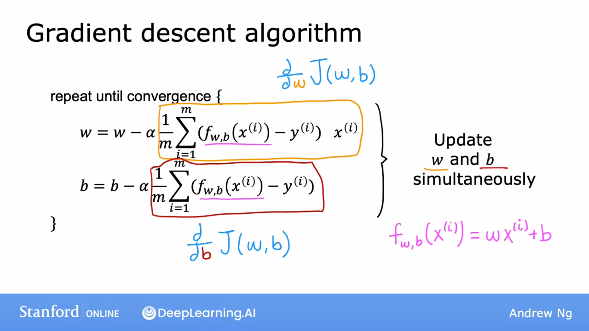
 > 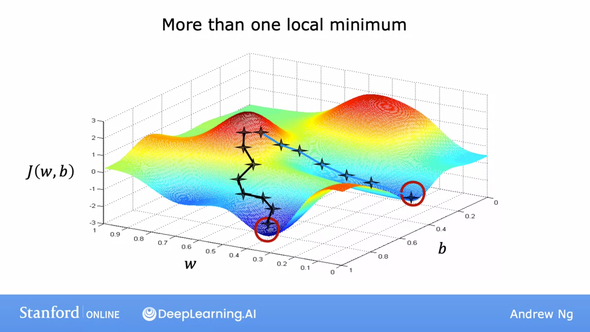
 > 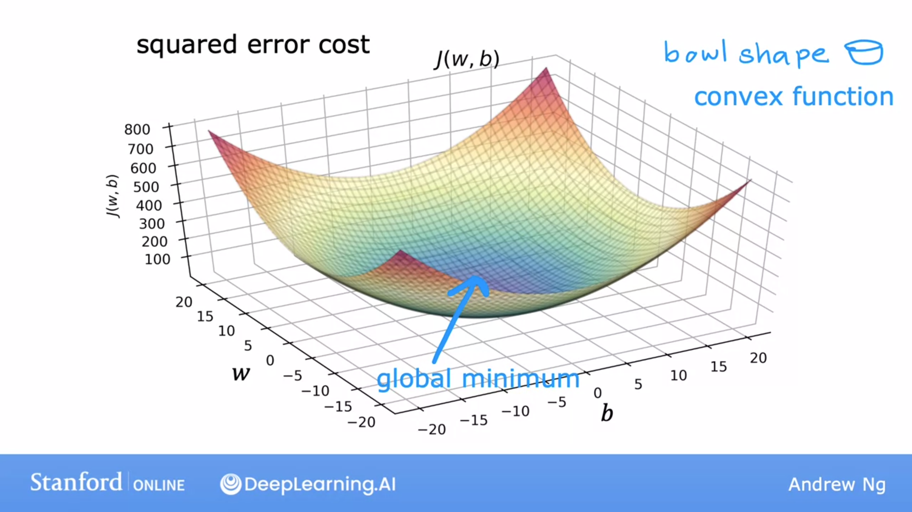

## Running gradient descent

 > 
 > 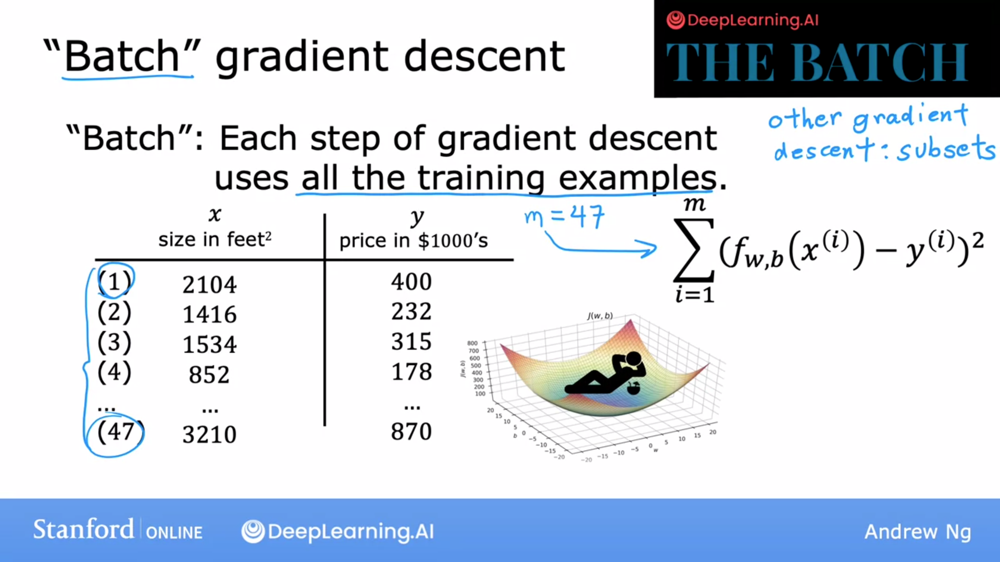

## Optional lab: Gradient descent

# Practice quiz: Train the model with gradient descent

