# Advice for applying machine learning

This week you'll learn best practices for training and evaluating your learning algorithms to improve performance. This will cover a wide range of useful advice about the machine learning lifecycle, tuning your model, and also improving your training data.

# Advice for applying machine learning

## Deciding what to try next

"I've seen teams sometimes, say six months to build a machine learning system, that I think a more skilled team could have taken or done in just a couple of weeks." The efficiency of how quickly you can get a machine learning system to work well, will depend to a large part on how well you can repeatedly make good decisions 

> 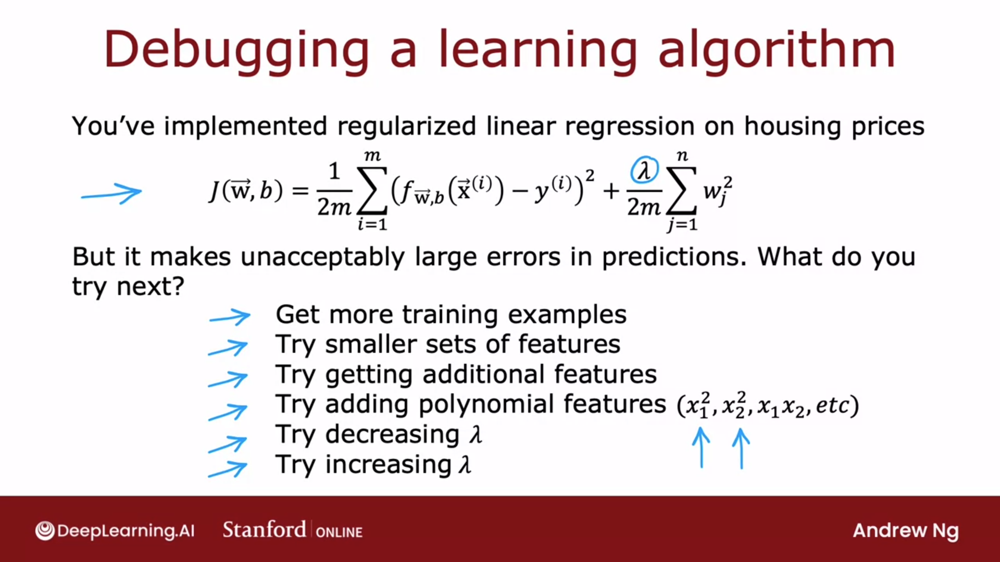

Diagnostics can take time to implement, but running them can be a very good use of your time

> 

## Evaluating a model

In the graph below, we use just a single feature (the size of the house) and we can see the curve is very weakly so we know this parody isn't a good model. But with more features it becomes much harder to plot f() and detect the model is not correct

We need some more systematic way to evaluate how well your model is doing

> 

Let's put 70% of the data into the first part to the train the model. 
And the second part of the data, 30% of the data, to test his performance

> 

Cost function is used to train the model, but cost function (without regularization term) is also computed on test set in order to know if the model is doing well.

> 

In that case, cost function is fine on training set, but is not acceptable on test set.

> 

The same approach is also woking for classification problem

> 

For classification, you could use the fraction of missclassified to get acceptance test

> 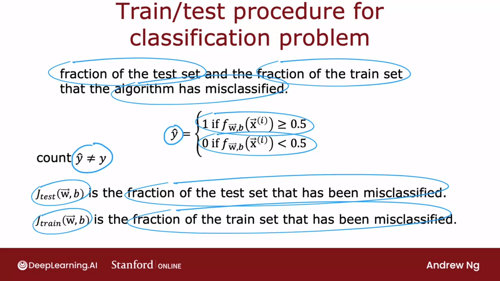

## Model selection and training/cross validation/test sets

> 

One procedure (no the best) would be to compare these $J_{test}$ function, and select the one with the lowest value
The procedure on this particular slide is flawed and not recommended 
The reason this procedure is flawed is J test of $w^5$, $b^5$ is likely to be an optimistic estimate of the generalization error, because with basic fits, one extra parameter (the degree of polynomial) was chosen using the test set

> 

 Instead, if you want to automatically choose a model (what degree polynomial to use) amongst different models (such as these 10 different models that you might contemplate using for your machine learning application) itś recommended to modify the training and testing procedure

We split the data into three different subsets :
 - training set, 
 - the cross-validation set, 
 - and then also the test set.  

The name **cross-validation set** refers to that this is an extra dataset used to check or trust check the validity or really the accuracy of different models (not a great name, but used by people in machine learning). Also called **validation set**, or **development set**

> 

Onto these three subsets we then compute the training error, the cross-validation error, and the test error using these three formulas. 

> 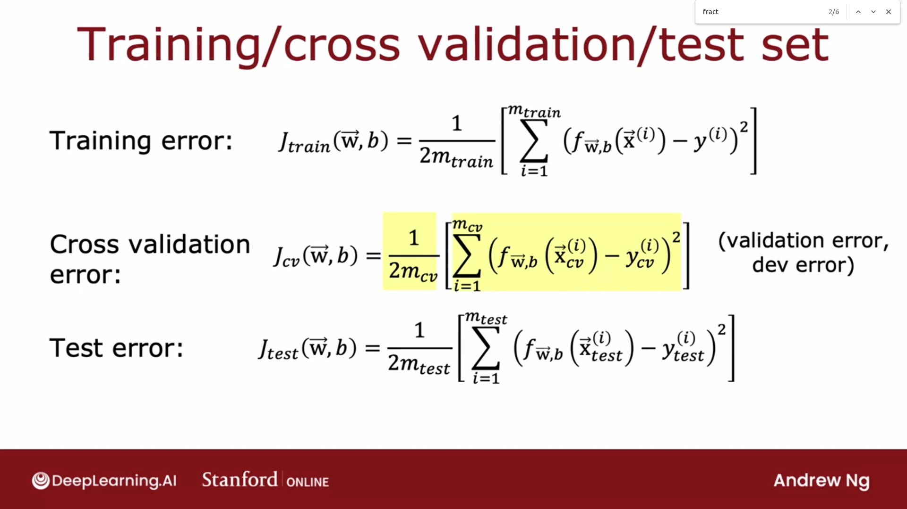

But instead of evaluating this on test set, we evaluate these parameters on cross-validation sets and compute $J_cv$ of $w^{<1>}$, $b^{<1>}$, ... $w^{<10>}$, $b^{<10>}$ and chose the one that have the lowest cross-validation error

If we choose model 4, because $J_{cv}(w^{<4>},b^{<4>})$ is the lowest value, we then evaluate if the generalisation of the model is good with $J_{test}(w^{<4>},b^{<4>})$

The procedure is fair because :
1. we train the models with test set (choose w, b)
2. we choose the model with cross-validation set (choose degree)
3. test set is not used for chhosing any parameters,so we keep it to estimate the erro

> 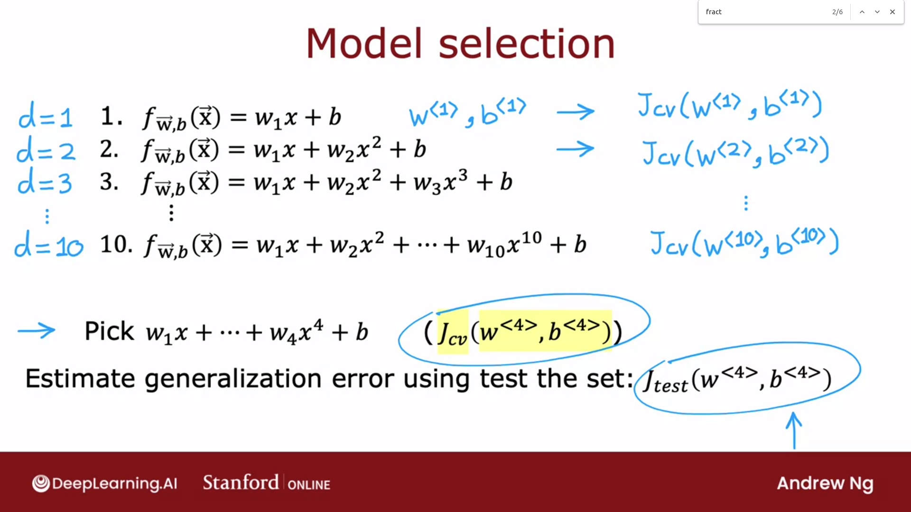

This model selection procedure also works for choosing among other types of models. For example, choosing a neural network architecture

> 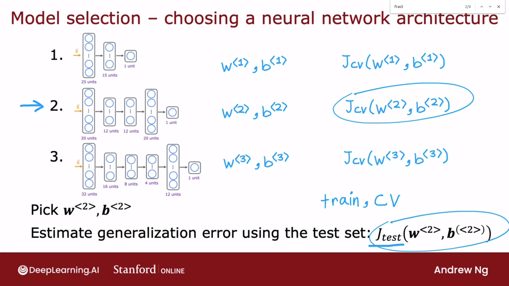

## Optional Lab: Model Evaluation and Selection

# Practice quiz: Advice for applying machine learning

# Bias and variance

## Diagnosing bias and variance

The typical workflow of developing a machine learning system is that you have an idea and you train the model, and you almost always find that it doesn't work as well as you wish yet. How to decide what to do next in order to improve his performance? Looking at the bias and variance of a learning algorithm gives very good guidance on what to try next

> 

Evolution of $J_{train}$ and $J_{cv}$
> 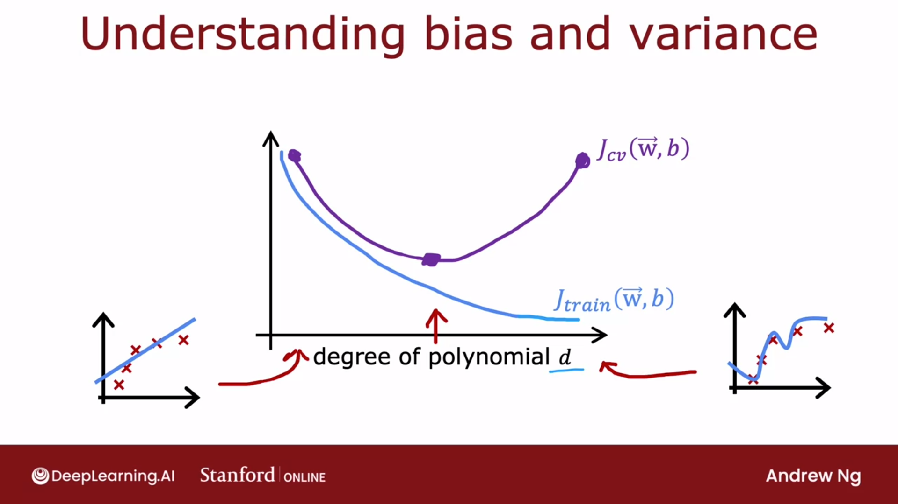

In this example, which looks artificial because it's a single feature input, we fit the training set really well and we overfit in part of the input, and we don't even fit the training data well, and we underfit the part of the input. 
In that case 
- $J_{train}$ is high AND
- the cross-validation error is much larger than the training set

> 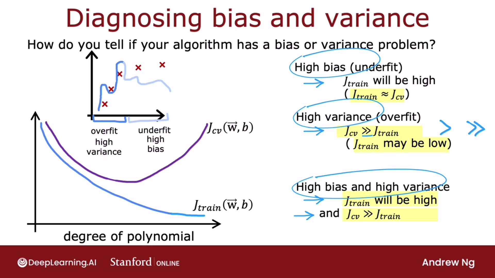

## Regularization and bias/variance

Lambda is the regularization parameter that controls how much we trade-off :
- keeping the parameters w small versus 
- fitting the training data well

How to choose a good value for lambda?

> 

This would be procedures similar to what you had seen for choosing the degree of polynomial using cross-validation : 
- minimize $J(w,b)$, 
- find $W^{<1>}$ et $b^{<1>}$, 
- and then compute the cross-validation error, $J_{cv}($W^{<1>}$, $b^{<1>}$))
Repeat for next value of lambda

Pick the model lowest with the lowest value of J for crosll validation set

> 

Intuition of how training error and cross validation error vary as a function of the parameter Lambda.

> 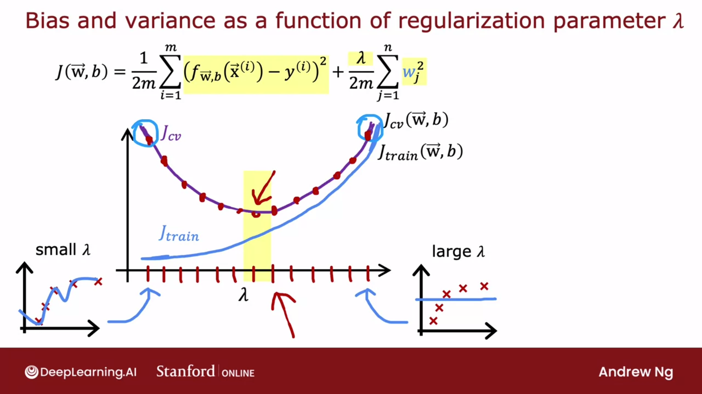

If you compare this diagram to the one where the horizontal axis was the degree of polynomial, these two diagrams look a little bit not mathematically and not in any formal way, but they look a little bit like mirror images of each other. That's because when you're fitting a degree of polynomial, the left part of this curve corresponded to underfitting and high bias, the right part corresponded to overfitting and high variance.

> 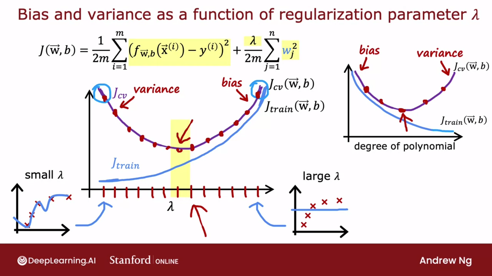

Now, so far, we've seen that having an high $J_{train}$ is indicative of high bias and how having a high cross-validation error $J_{cv}$, specifically if it's much higher than training error, is indicative of variance problem. 

But what does these words "high" or "much higher" actually mean? In order to answer the question, we introduce the notion of baseline level of performance.

## Establishing a baseline level of performance

There's a lot of noisy audio where really no one can accurately transcribe what was said because of the noise in the audio. If even a human makes 10.6 percent error, then it seems difficult to expect a learning algorithm to do much better. 

When we benchmark it to human level performance, we see that the algorithm is actually doing quite well on the training set, but the bigger problem is the cross-validation error is much higher than the training error and so algorithm actually has more of a variance problem than a bias problem

> 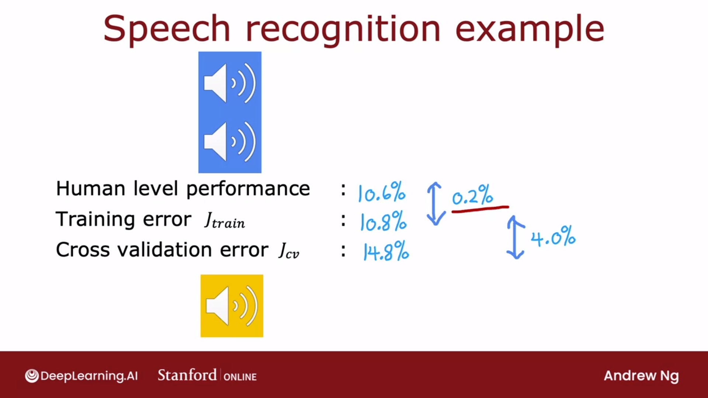

We can establish baseline by :
- human measure
- previous implementation that someone else has implemented
- guess-based

> 

Depending on gap, we habe bias, variance of both issues.

> 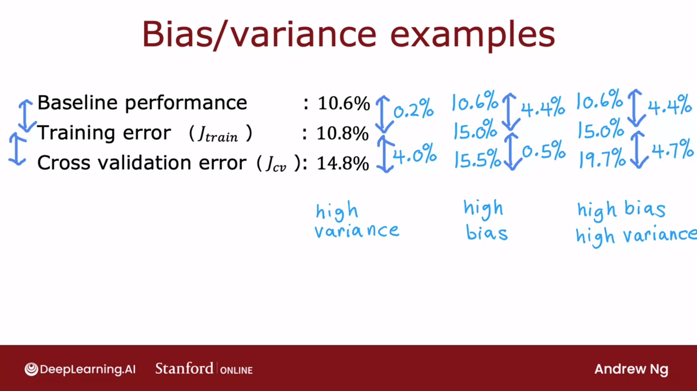

## Learning curves

If model is too simple to be fitting into much data, both of $J_{cv}$ and $J_{train}$ curves tend to flatten after a while.

> 

There's a big gap between the baseline level of performance and $J_{train}$, which was our indicator for this algorithm having high bias.

That gives this conclusion, maybe a little bit surprising, that if a learning algorithm has high bias, getting more training data will not by itself hope that much

> 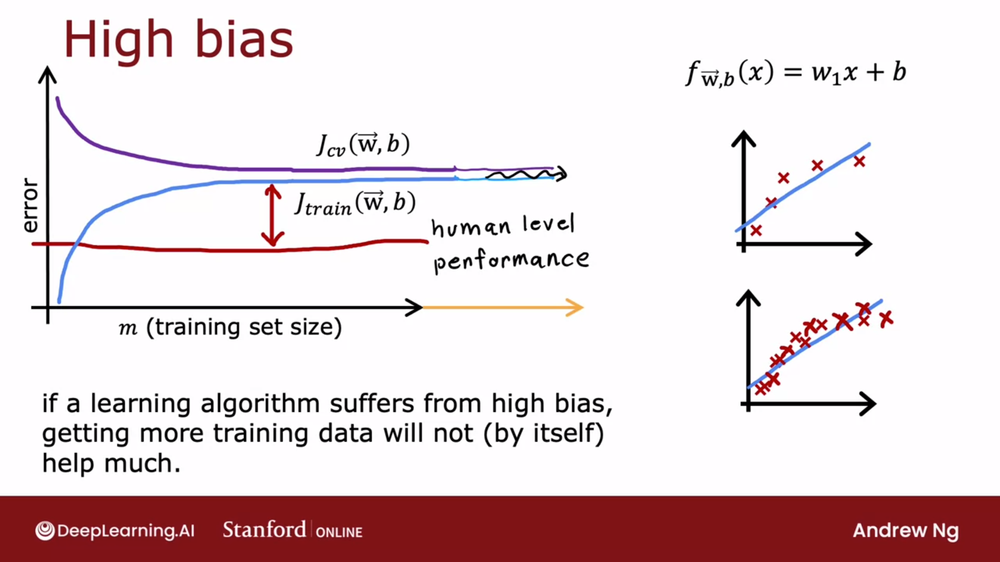

When you have high variance, then increasing the training set size could help a lot

> 

It is computationally quite expensive to train so many different models using different size subsets of your training set, so in practice, it isn't done that often, but nonetheless, I find that having this mental visual picture in my head of what the training set looks like, sometimes that helps me to think through what I think my learning algorithm is doing and whether it has high bias or high variance. 

"Bias and variance is one of those concepts that takes a short time to learn, but takes a lifetime to master."

## Deciding what to try next revisited

> 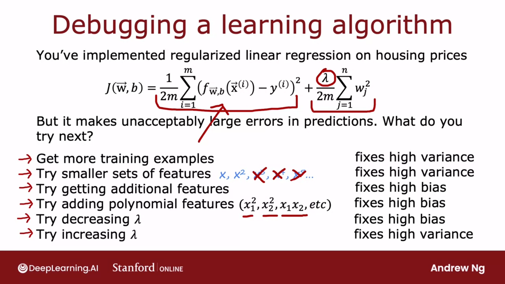

## Bias/variance and neural networks

And if you hear machine learning engineers talk about the bias variance tradeoff, they're referring to where if you have too simple a model, you have high bias, too complex a model high variance

> 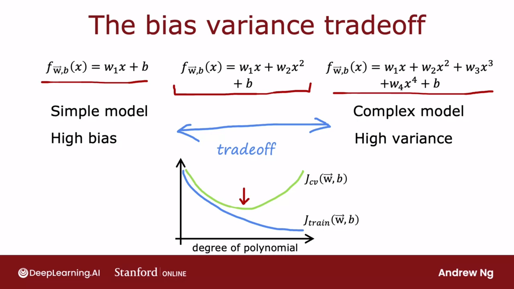

If you make your neural network large enough, you can almost always fit your training set well. This gives us a new recipe to try to reduce bias or reduce variance as needed without needing to really trade off between the
 two of them.

Now, of course there are limitations of the application of this recipe
 - training bigger neural network get computationally expensive. That's why the rise of neural networks has been really assisted by the rise of very fast computers, including especially GPUs or graphics processing units
 - beyond a certain point it's hard to get much more data. 

> 

It almost never hurts to go to launch a neural network so long as you regularized appropriately with one caveat, it does become more computational expensive. 

> 

In tensorflow :

> 

## Optional Lab: Diagnosing Bias and Variance

# Practice quiz: Bias and variance

# Machine learning development process

## Iterative loop of ML development

> 

Example for spam classification

> 

You iplement that kind of algorithm

> 

- Honeypot projects ar projects that create a large number of fake email addresses and tries to deliberately to get these fake email addresses into the hands of spammers 

> 

Depending of diagnostics, you change the architecture, and continue the loop  

> 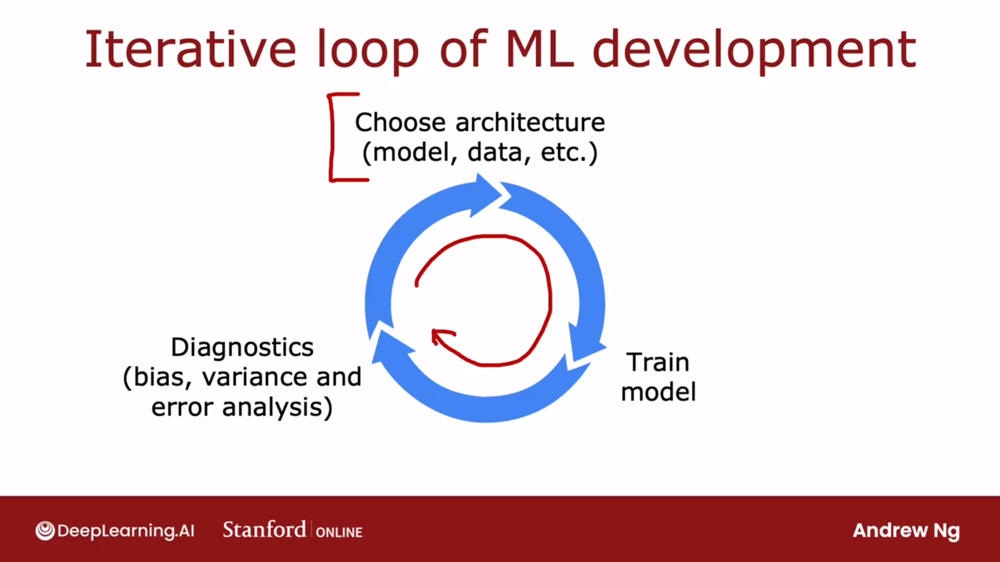

## Error analysis

The error analysis process just refers to manually looking through these 100 examples and trying to gain insights into where the algorithm is going wrong. Pharmaceutical spam and emails trying to steal passwords or phishing emails seem to be huge problems whereas deliberate misspellings

If you have a large cross validation of 5,000 example and if the algorithm misclassified 1,000 of them then you may often sample randomly a subset of 100 that you can analyse in a reasonable amount of time and get enough statistics about whether the most common types of errors and therefore where maybe most fruitful to focus your attention. After this analysis, if you find that a lot of errors are pharmaceutical spam emails then this might give you some ideas or inspiration for things to do next. 

> 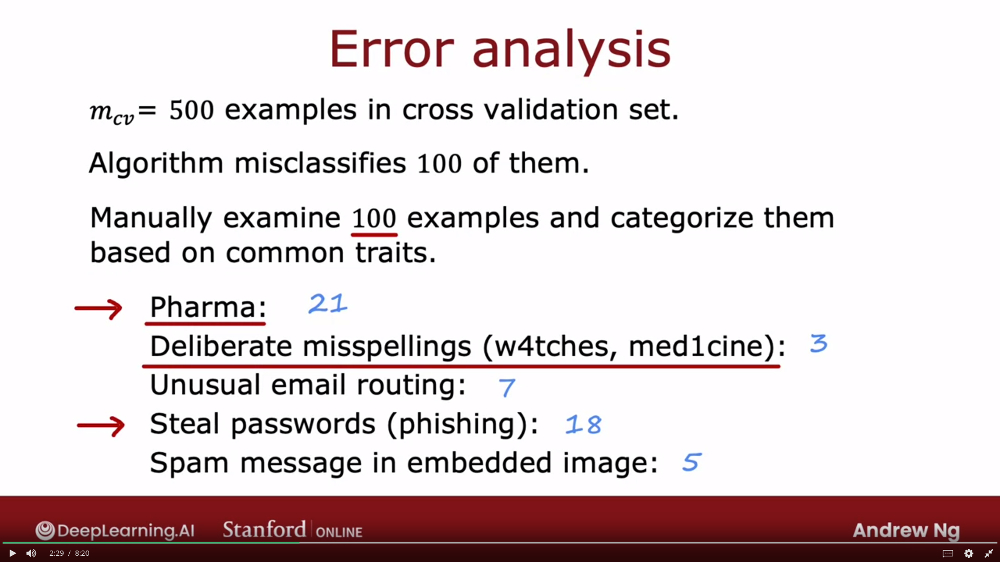

Based on our error analysis in the example more sophisticated email features could help but only a bit whereas more sophisticated features to detect former spam or phishing emails could help a lot.

Instead of collecting more data but not more data of everything, we may focus on data of pharmaceutical spam emails (specific names of pharmaceutical product)

> 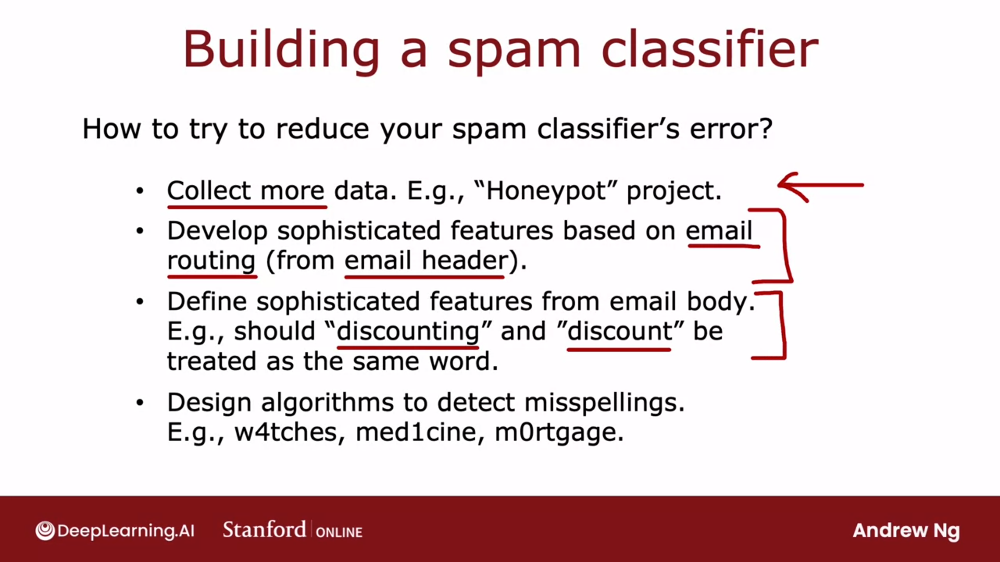

Now one limitation of error analysis is that it's much easier to do for problems that humans are good at. You can look at the email and say you think is a spam email. But rrror analysis can be a bit harder for tasks that even humans aren't good at 
(predict what ads someone will click on on the website)

> 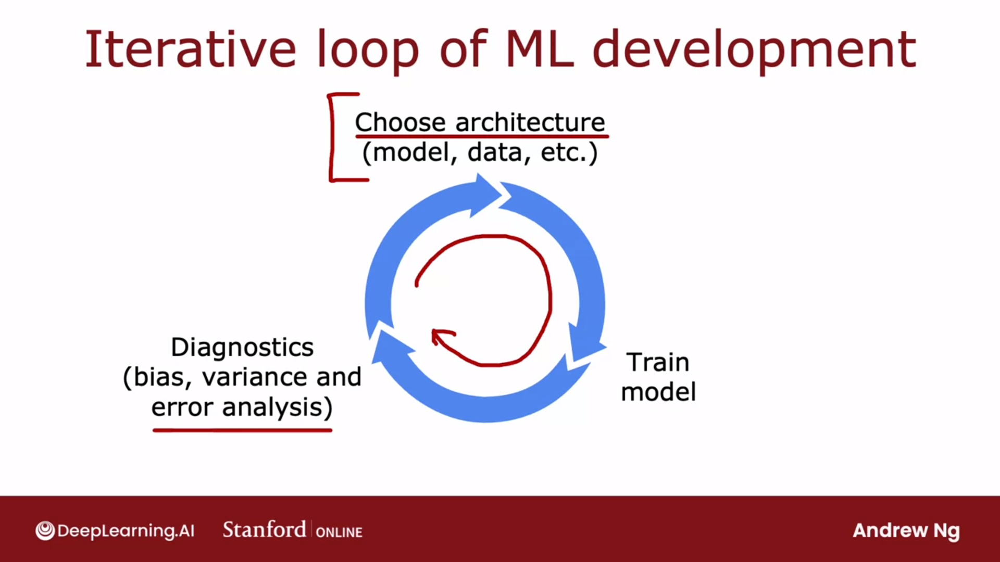

## Adding data

Trying to get more data of all types can be slow and expensive. Instead, an alternative way of adding data might be to focus on adding more data of the types where analysis has indicated it might help. 

There's another technique that's why they use especially for images and audio data that can increase your training set size significantly. This technique is called **data augmentation**.

> 

Given an image we can create a new training example by rotating the image a bit, enlarging the image a bit, shrinking or by changing the contrast

> 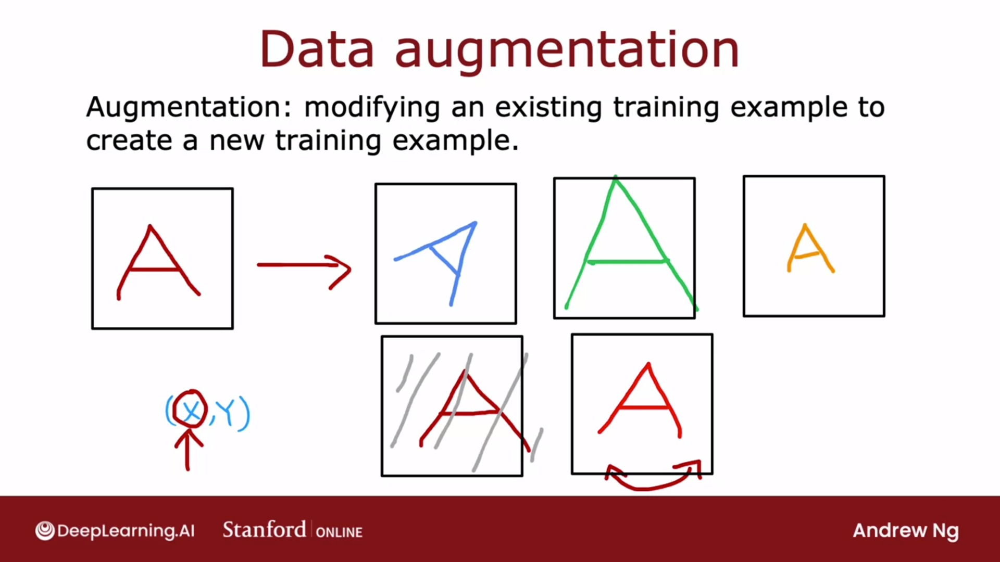

Distorting one image can feed to the learning algorithm to learn more robust

> 

For audit, you can add crowd background noise, or car noise, to simullate the speaker speaking from a car.   

> 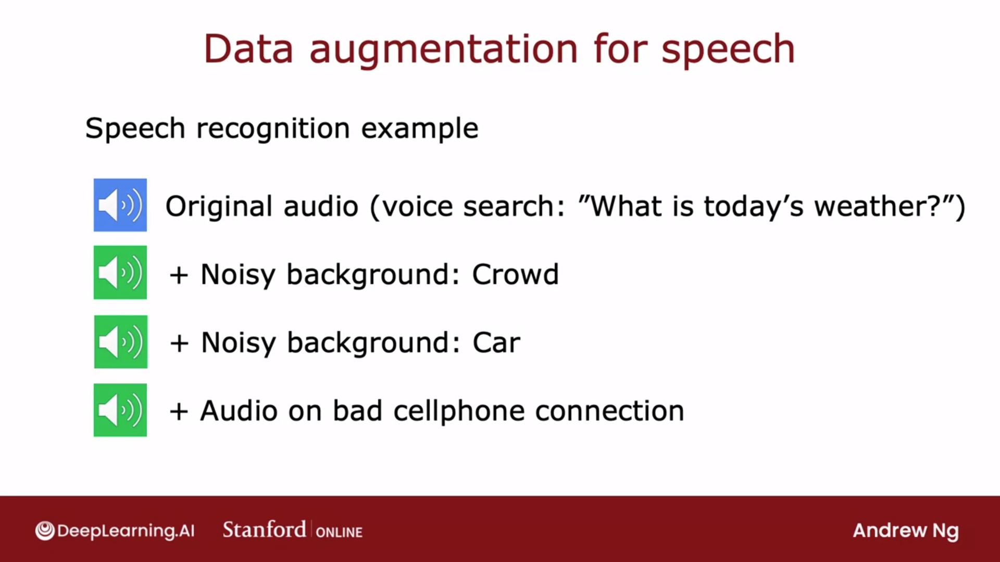

One tip for data augmentation is that the changes or the distortions you make to the data, should be representative of the types of noise or distortions in the test set.

> 

There's one of the techniques which is **data synthesis** in which you make up brand new examples from scratch. Not by modifying an existing example but by creating brand new examples.

> 

> <!--img src="./w03-12-Adding_data/img_2023-02-05_09-40-06.png"-->

So one way to create artificial data for this task is if you go to your computer's text editor
 
> 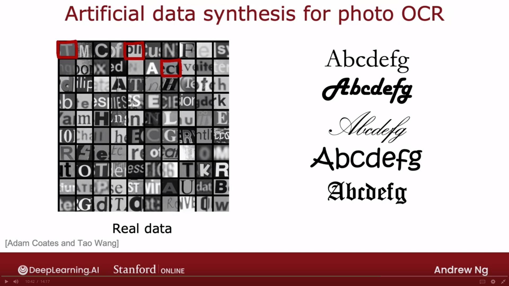

And screenshot tetx editors using different colors and different contrasts and very different fonts and you get synthetic data like that on the right.

> 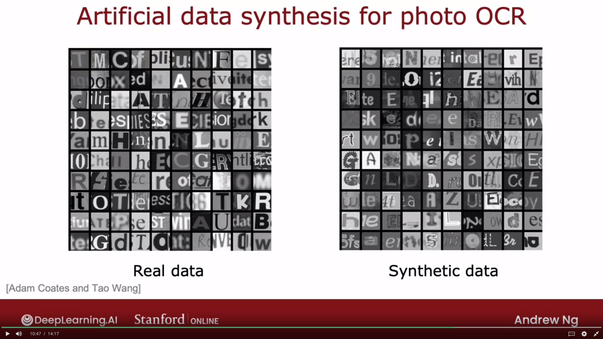

Algorithm we have access to linear regression, logistic regression, neural networks, also decision trees are very good today and will work well for many applications. And so sometimes it can be more fruitful to spend more of your time taking a data centric approach in which you focus on engineering the data used by your algorithm

> 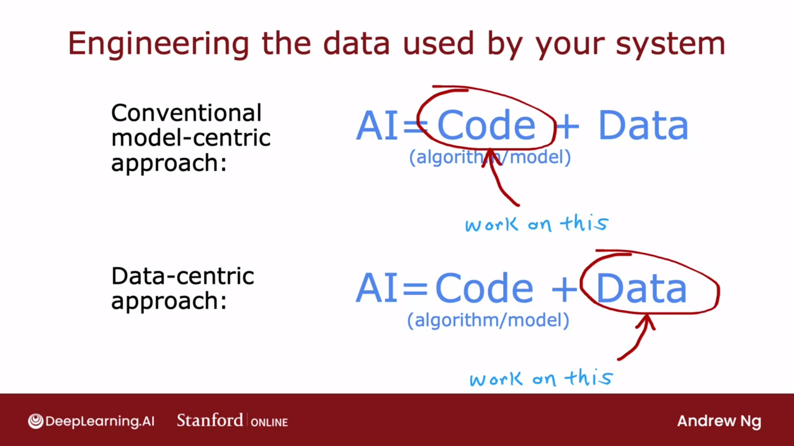

## Transfer learning: using data from a different task

Let's say you want to recognize the handwritten digits from zero through nine but you don't have that much labeled data of these handwritten digits

Say you find a very large datasets of one million images of pictures of cats, dogs, cars, people, and so on, a thousand classes. You can then start by training a neural network on this large dataset of a million images with a thousand different classes and train the algorithm to take as input an image X, and learn to recognize any of these 1,000 different classes.

But for the last layer, you would eliminate the output layer and replace it with a much smaller output layer with just 10 rather than 1,000 output units. These 10 output units will correspond to the classes zero, one, through nine that you want your neural network to recognize. 

In detail, there are two options for how you can train this neural networks parameters:
- option 1 is you only train the output layers parameters
- Option 2 would be to train all the parameters in the network 

If you have a very small training set then Option 1 might work a little bit better, but if you have a training set that's a little bit larger then Option 2 might work a little bit bette

These two steps are called : 
- supervised pre-training, first step of first training on a large dataset
- fine tuning where you take the parameters that you had initialized or gotten from supervised pre-training and then run gradient descent further to fine tune the weights to suit the specific application

> 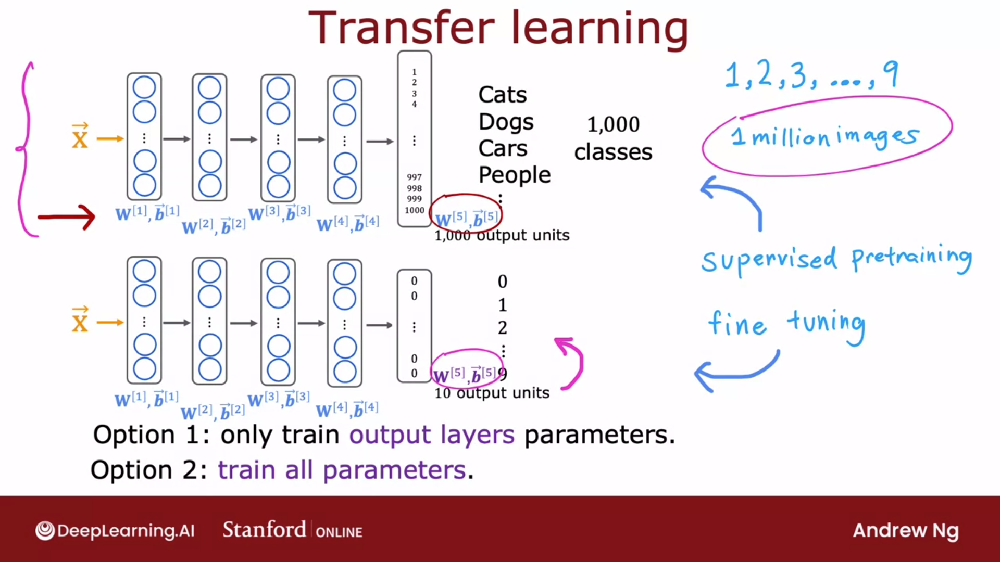

Learning on detecting lots of different images (dogs, car, etc), you're teaching the neural network to detect edges, corners, and basic shapes. This is useful for many other computer vision tasks

> 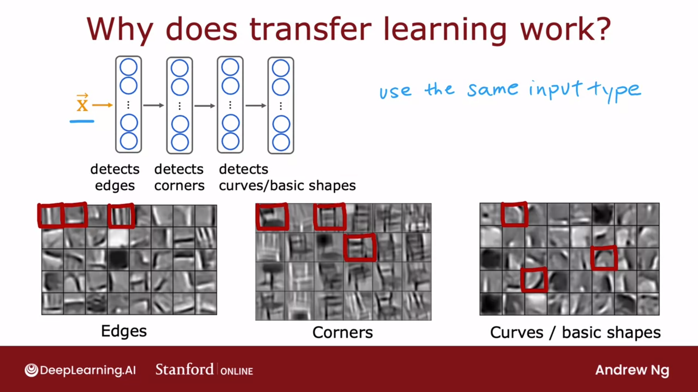

I'd sometimes train neural networks on as few as 50 images that were quite well using this technique, when it has already been pre-trained on a much larger dataset. 

**GPT-3** or BERTs or neural networks pre-trained on ImageNet, are actually examples of neural networks that they have someone else's pre-trained on a very large image datasets or text dataset, they can then be fine tuned on other applications 

> 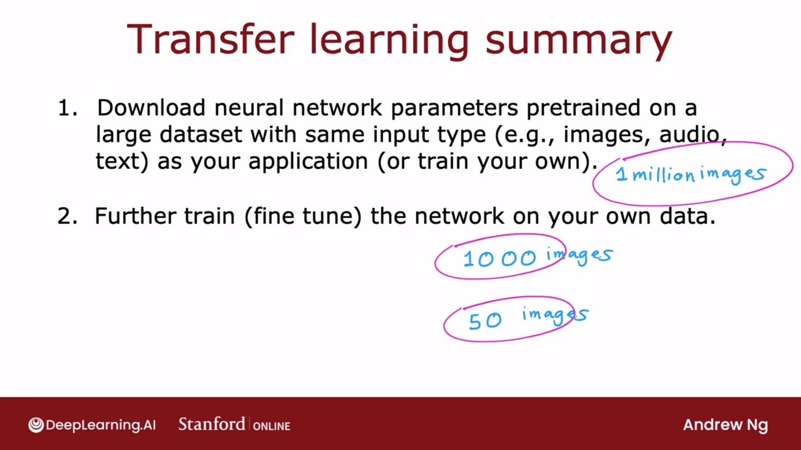

## Full cycle of a machine learning project

> 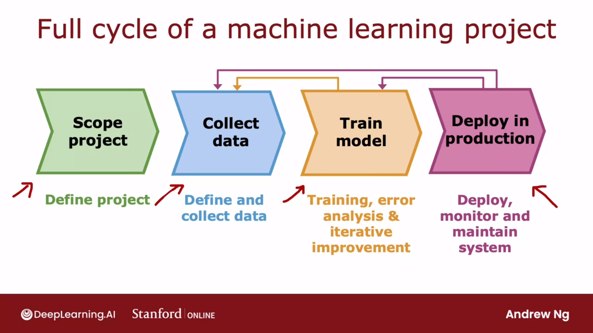

There is a growing field in machine learning called (MLOps Machine Learning Operations). 
This refers to the practice of how to systematically build and deploy and maintain machine learning systems (reliability, scalability, monitoring, but also the opportunity to make **updates** to the model as appropriate to keep it running well)

> 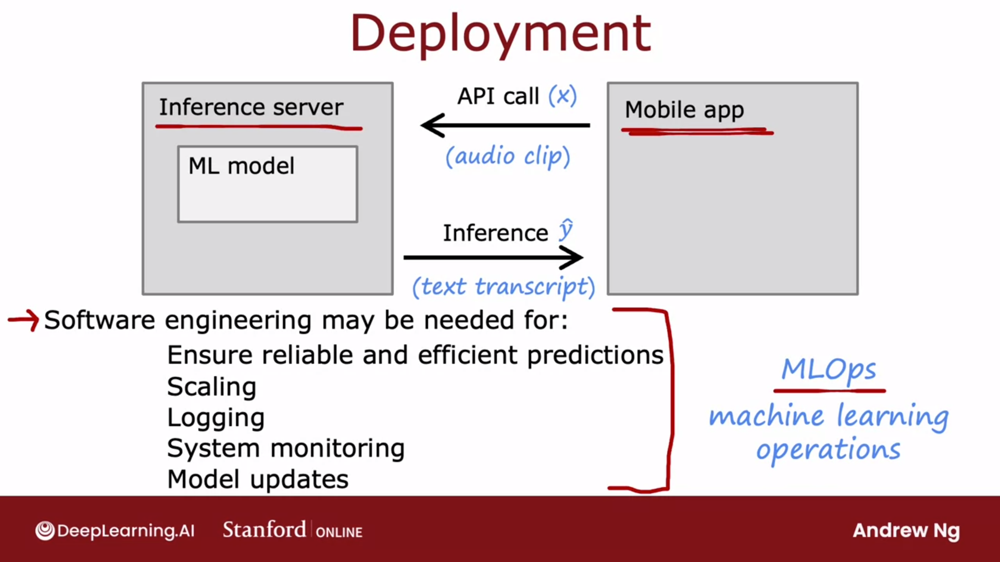

## Fairness, bias, and ethics

> 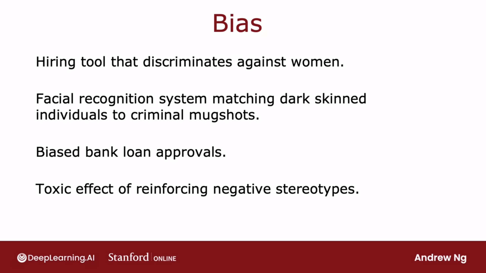

> 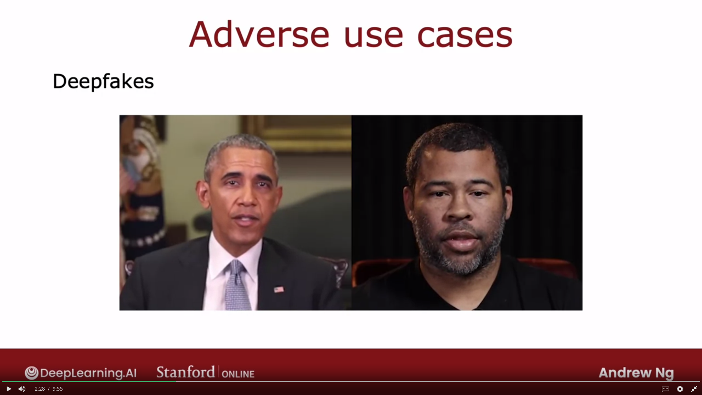

> 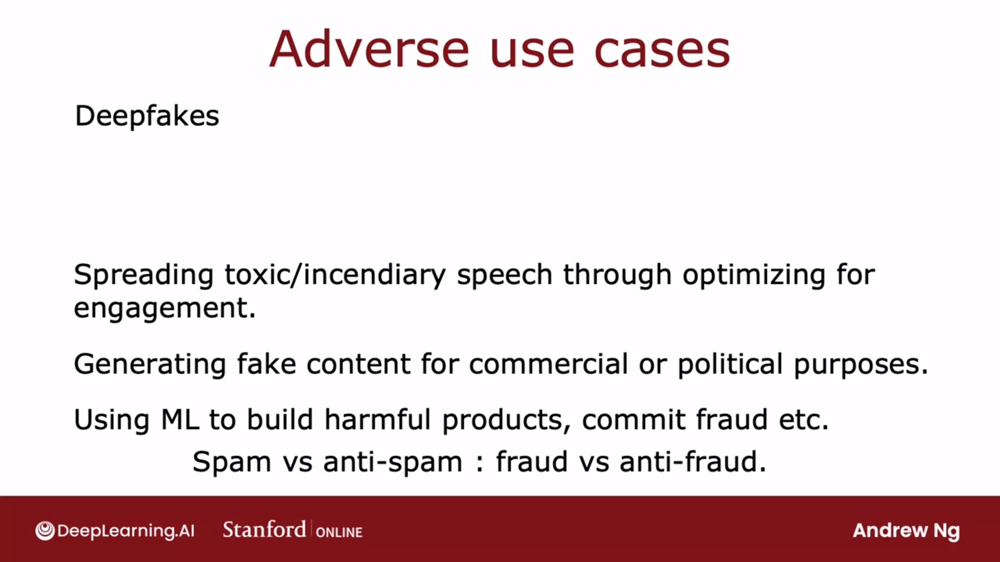

> 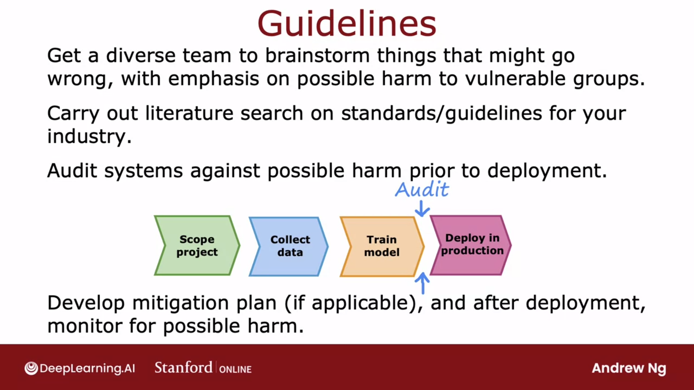

# Practice quiz: Machine learning development process

# Skewed dataset (Optional)

## Error metrics for skewed datasets

## Trading off precision and recall

# Practice Lab: Advice for Applying Machine Learning
