# Advice for applying machine learning

This week you'll learn best practices for training and evaluating your learning algorithms to improve performance. This will cover a wide range of useful advice about the machine learning lifecycle, tuning your model, and also improving your training data.

# Advice for applying machine learning

## Deciding what to try next

"I've seen teams sometimes, say six months to build a machine learning system, that I think a more skilled team could have taken or done in just a couple of weeks." The efficiency of how quickly you can get a machine learning system to work well, will depend to a large part on how well you can repeatedly make good decisions 

> 

Diagnostics can take time to implement, but running them can be a very good use of your time

> 

## Evaluating a model

In the graph below, we use just a single feature (the size of the house) and we can see the curve is very weakly so we know this parody isn't a good model. But with more features it becomes much harder to plot f() and detect the model is not correct

We need some more systematic way to evaluate how well your model is doing

> 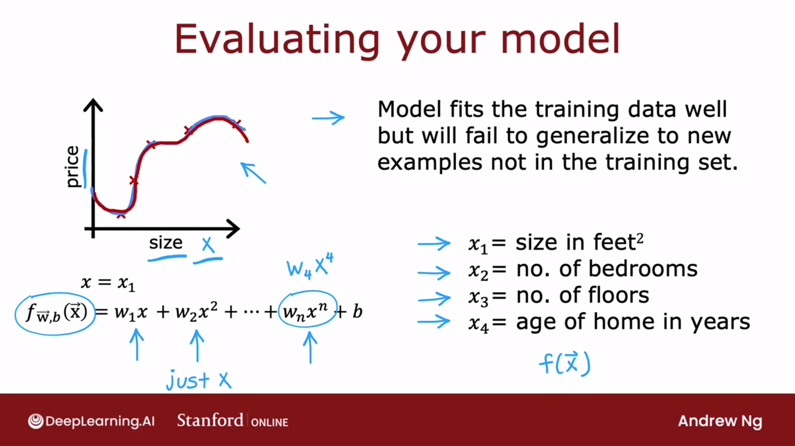

Let's put 70% of the data into the first part to the train the model. 
And the second part of the data, 30% of the data, to test his performance

> 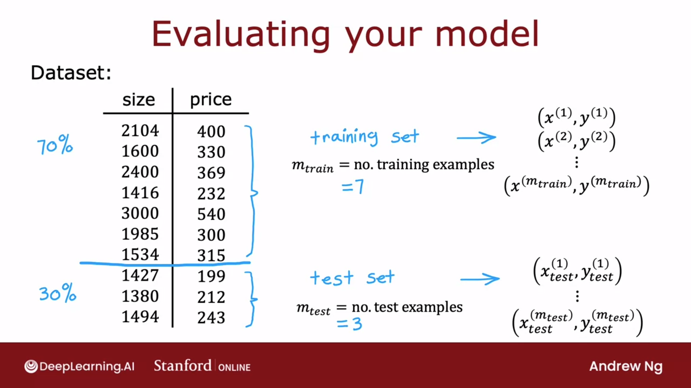

Cost function is used to train the model, but cost function (without regularization term) is also computed on test set in order to know if the model is doing well.

> 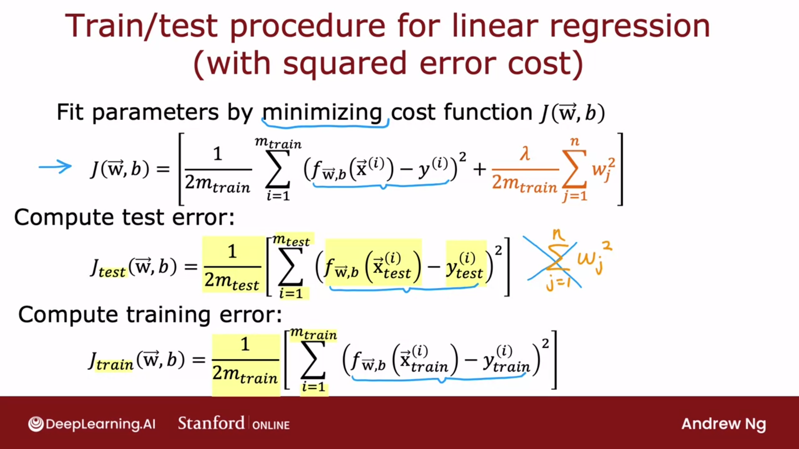

In that case, cost function is fine on training set, but is not acceptable on test set.

> 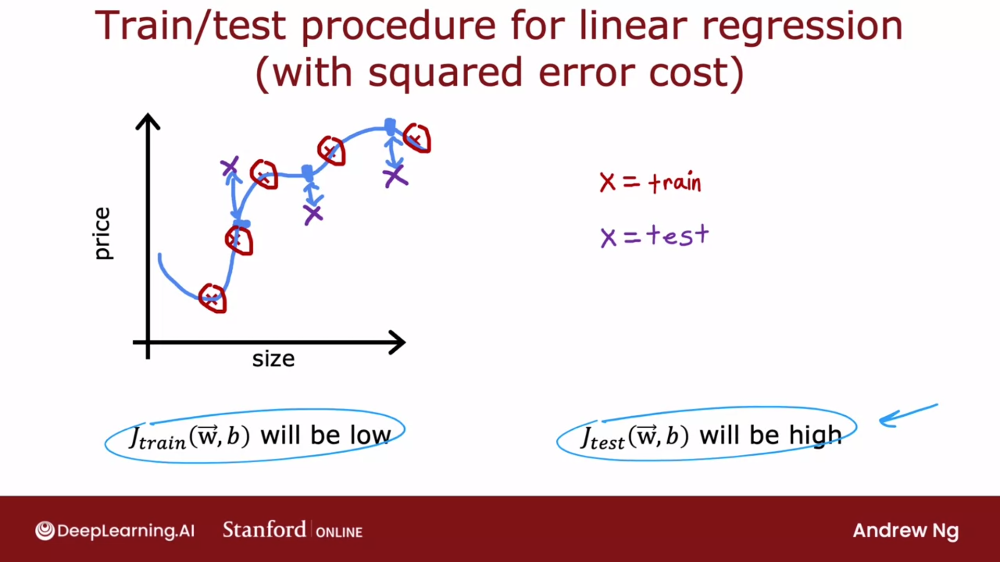

The same approach is also woking for classification problem

> 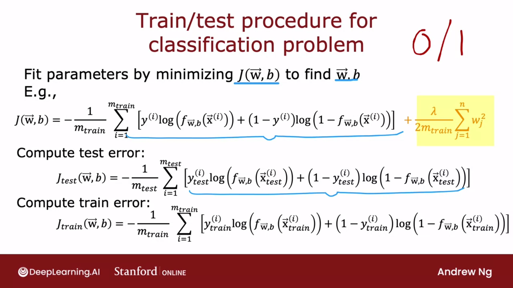

For classification, you could use the fraction of missclassified to get acceptance test

> 

## Model selection and training/cross validation/test sets

> 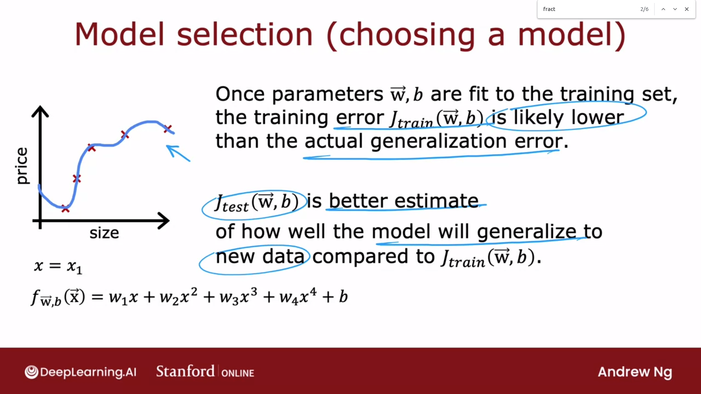

One procedure (no the best) would be to compare these $J_{test}$ function, and select the one with the lowest value
The procedure on this particular slide is flawed and not recommended 
The reason this procedure is flawed is J test of $w^5$, $b^5$ is likely to be an optimistic estimate of the generalization error, because with basic fits, one extra parameter (the degree of polynomial) was chosen using the test set

> 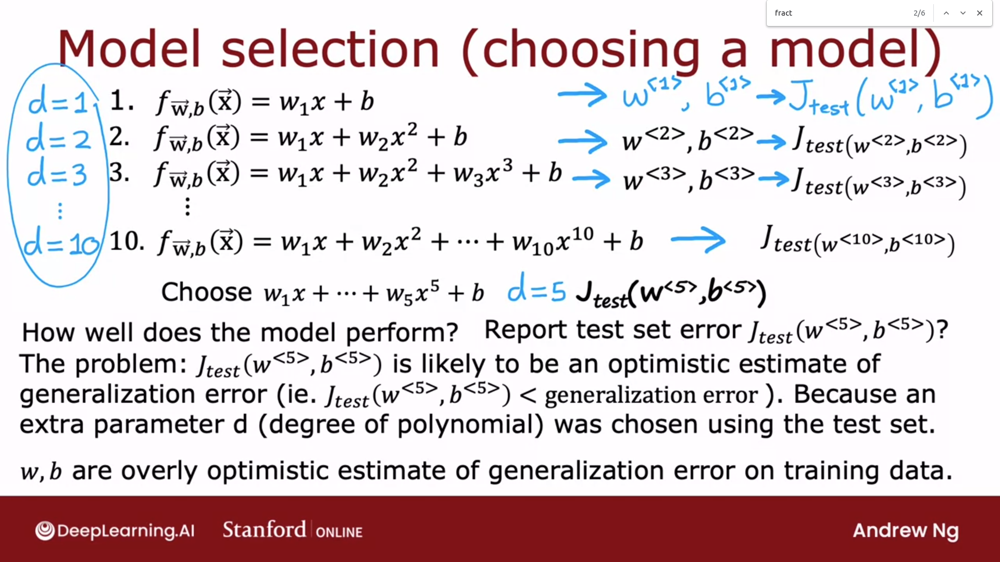

 Instead, if you want to automatically choose a model (what degree polynomial to use) amongst different models (such as these 10 different models that you might contemplate using for your machine learning application) itś recommended to modify the training and testing procedure

We split the data into three different subsets :
 - training set, 
 - the cross-validation set, 
 - and then also the test set.  

The name **cross-validation set** refers to that this is an extra dataset used to check or trust check the validity or really the accuracy of different models (not a great name, but used by people in machine learning). Also called **validation set**, or **development set**

> 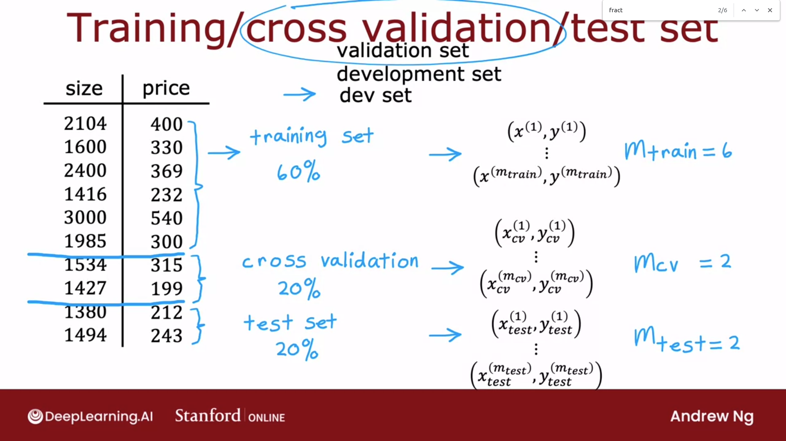

Onto these three subsets we then compute the training error, the cross-validation error, and the test error using these three formulas. 

> 

But instead of evaluating this on test set, we evaluate these parameters on cross-validation sets and compute $J_cv$ of $w^{<1>}$, $b^{<1>}$, ... $w^{<10>}$, $b^{<10>}$ and chose the one that have the lowest cross-validation error

If we choose model 4, because $J_{cv}(w^{<4>},b^{<4>})$ is the lowest value, we then evaluate if the generalisation of the model is good with $J_{test}(w^{<4>},b^{<4>})$

The procedure is fair because :
1. we train the models with test set (choose w, b)
2. we choose the model with cross-validation set (choose degree)
3. test set is not used for chhosing any parameters,so we keep it to estimate the erro

> 

This model selection procedure also works for choosing among other types of models. For example, choosing a neural network architecture

> 

## Optional Lab: Model Evaluation and Selection

# Practice quiz: Advice for applying machine learning

# Bias and variance

## Diagnosing bias and variance

The typical workflow of developing a machine learning system is that you have an idea and you train the model, and you almost always find that it doesn't work as well as you wish yet. How to decide what to do next in order to improve his performance? Looking at the bias and variance of a learning algorithm gives very good guidance on what to try next

> 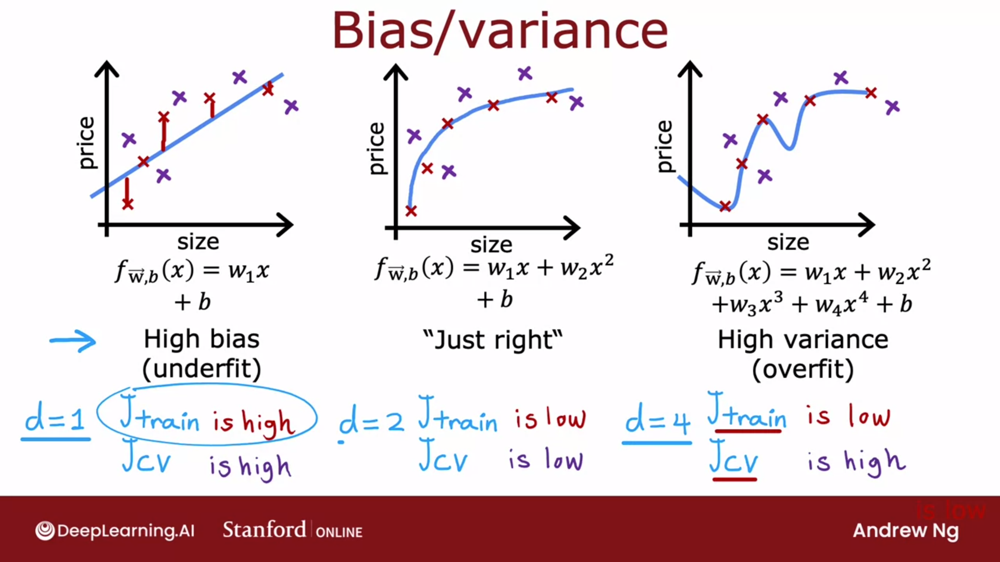

Evolution of $J_{train}$ and $J_{cv}$
> 

In this example, which looks artificial because it's a single feature input, we fit the training set really well and we overfit in part of the input, and we don't even fit the training data well, and we underfit the part of the input. 
In that case 
- $J_{train}$ is high AND
- the cross-validation error is much larger than the training set

> 

## Regularization and bias/variance

Lambda is the regularization parameter that controls how much we trade-off :
- keeping the parameters w small versus 
- fitting the training data well

How to choose a good value for lambda?

> 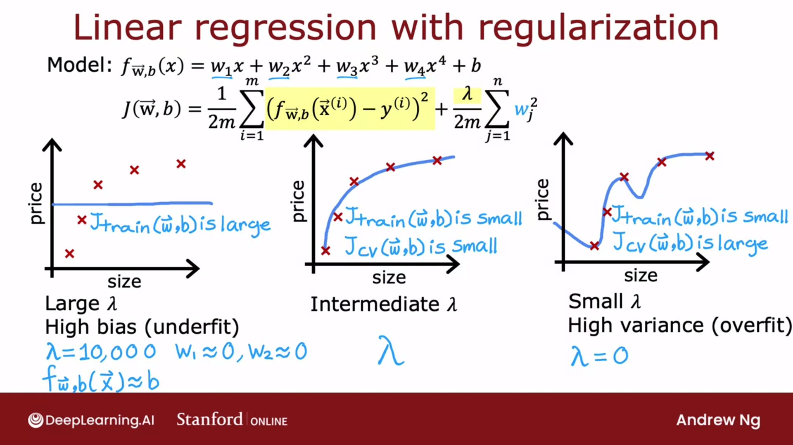

This would be procedures similar to what you had seen for choosing the degree of polynomial using cross-validation : 
- minimize $J(w,b)$, 
- find $W^{<1>}$ et $b^{<1>}$, 
- and then compute the cross-validation error, $J_{cv}($W^{<1>}$, $b^{<1>}$))
Repeat for next value of lambda

Pick the model lowest with the lowest value of J for crosll validation set

> 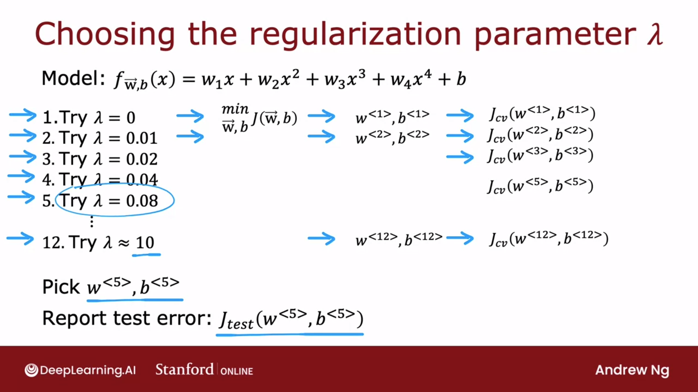

Intuition of how training error and cross validation error vary as a function of the parameter Lambda.

> 

If you compare this diagram to the one where the horizontal axis was the degree of polynomial, these two diagrams look a little bit not mathematically and not in any formal way, but they look a little bit like mirror images of each other. That's because when you're fitting a degree of polynomial, the left part of this curve corresponded to underfitting and high bias, the right part corresponded to overfitting and high variance.

> 

Now, so far, we've seen that having an high $J_{train}$ is indicative of high bias and how having a high cross-validation error $J_{cv}$, specifically if it's much higher than training error, is indicative of variance problem. 

But what does these words "high" or "much higher" actually mean? In order to answer the question, we introduce the notion of baseline level of performance.

## Establishing a baseline level of performance

There's a lot of noisy audio where really no one can accurately transcribe what was said because of the noise in the audio. If even a human makes 10.6 percent error, then it seems difficult to expect a learning algorithm to do much better. 

When we benchmark it to human level performance, we see that the algorithm is actually doing quite well on the training set, but the bigger problem is the cross-validation error is much higher than the training error and so algorithm actually has more of a variance problem than a bias problem

> 

We can establish baseline by :
- human measure
- previous implementation that someone else has implemented
- guess-based

> 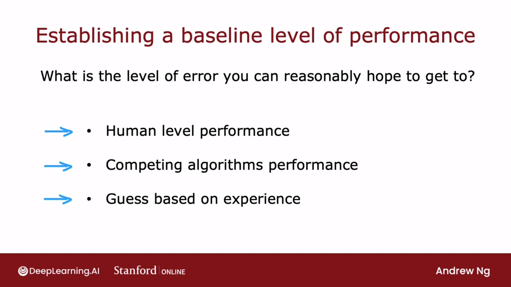

Depending on gap, we habe bias, variance of both issues.

> 

## Learning curves

## Deciding what to try next revisited

## Bias/variance and neural networks

## Optional Lab: Diagnosing Bias and Variance

# Practice quiz: Bias and variance

# Machine learning development process

## Iterative loop of ML development

## Error analysis

## Adding data

## Transfer learning: using data from a different task

## Full cycle of a machine learning project

## Fairness, bias, and ethics

# Practice quiz: Machine learning development process

# Skewed dataset (Optional)

## Error metrics for skewed datasets

## Trading off precision and recall

# Practice Lab: Advice for Applying Machine Learning
